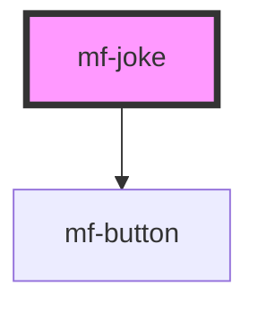

# mf-joke

<!-- Auto Generated Below -->

## Properties

| Property     | Attribute    | Description | Type       | Default    |
| ------------ | ------------ | ----------- | ---------- | ---------- |
| `categories` | --           |             | `string[]` | `[]`       |
| `firstName`  | `first-name` |             | `string`   | `'Chuck'`  |
| `lastName`   | `last-name`  |             | `string`   | `'Norris'` |

## Dependencies

### Depends on

- mf-button

### Graph

----------------------------------------------

*Built with [StencilJS](https://stenciljs.com/)*
